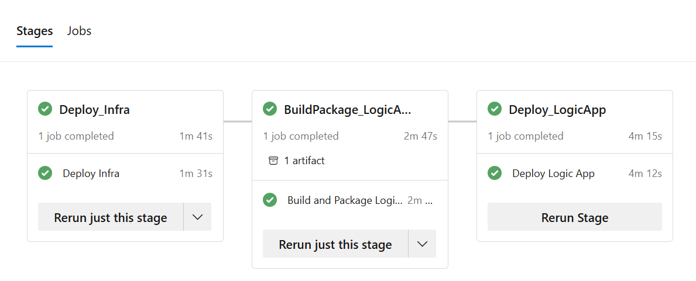
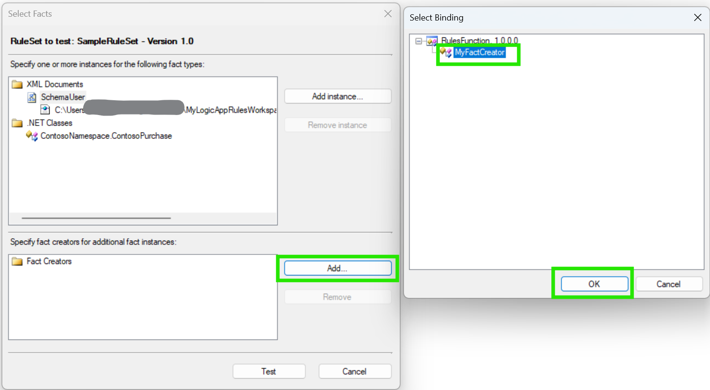
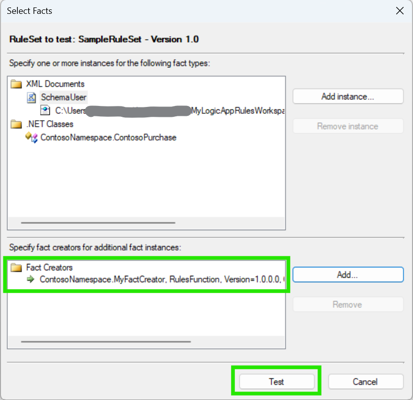

# Logic Apps BRE

A simple example of building and deploying a Logic App with Business Rules Engine (BRE).

Two Logic App Workflows which use the BRE are included:

* `MyRulesWorkflow`
* `PurchaseOrderWorkflow`

You can test these with the REST Client file `TestBRE.http` located in the `LogicApp` directory.

## Deploy infrastructure

Creates the Logic Apps Standard Single Tenant plan.

```bash
RESOURCE_GROUP_NAME=la-bre-cicd
LOCATION=australiaeast
SUBSCRIPTION_ID=xxxx-xxxx-xxxx-xxxx

az login
az account set --subscription $SUBSCRIPTION_ID

az group create --name $RESOURCE_GROUP_NAME --location $LOCATION

az bicep upgrade
az deployment group create --resource-group $RESOURCE_GROUP_NAME --template-file infra/bicep/deploy.bicep [--parameters @deploy.parameters.json]
```

## Build Logic App with BRE

Builds the Logic App with Business Rules Engine (BRE) assemblies bundled into a ZIP file.

Logic Apps with BRE require compiling and then adding any of your custom code libraries, including your .NET facts assemblies, to the `lib/custom/net472` folder in your logic app project where workflows look for custom functions to run.

```bash
# Build the Function App as a custom code library for Logic Apps
cd MyLogicAppRulesWorkspace/Function
dotnet restore ./RulesFunction.csproj
dotnet build ./RulesFunction.csproj

cd ../MyLogicAppRulesWorkspace/LogicApp
rm -f ./logicapps.zip
zip -r logicapps.zip . -x *local.settings.json -x *appsettings.json -x *__azurite_db_*.json -x *storage__ -x *.zip -x *.http -x *.env*
unzip -t logicapps.zip | grep "lib/custom" && echo "Custom Function is packaged" || echo "Missing Custom Function"
```

## Deploy Logic App with BRE

Deploys the Logic App with Business Rules Engine (BRE) assemblies bundled into a ZIP file to a Logic Apps Standard plan.

```bash
LOGIC_APP_NAME="$(az deployment group show --resource-group $RESOURCE_GROUP_NAME --name deploy --query properties.outputs.logicAppName.value -o tsv)"

az functionapp deploy --resource-group $RESOURCE_GROUP_NAME --name $LOGIC_APP_NAME --src-path logicapps.zip --type zip
```

If your Logic App using Connections (`connections.json`) or Parameters (`parameters.json`) files, you should include them in the ZIP file.  Do not include secrets in these files.  Either use Azure Key Vault references or App Settings for secrets.

## Deploying App Settings to your Logic App (Standard)

If your Logic App uses App Settings for configuration, you should create a `appsettings.json` file, e.g.

```json
{
  "setting1": "value1",
  "setting2": "value2"
}
```

Then apply the `appsettings.json` file to the Logic App:

```bash
az functionapp config appsettings set -g $RESOURCE_GROUP_NAME -n $LOGIC_APP_NAME --settings @appsettings.json
```

## Deploying new or updated RuleSets

You can directly deploy individual RuleSet files to the logic app plan's local filesystem after deploying the Logic App.  The RuleSets are located in the directory `/home/site/wwwroot/Artifacts/Rules/`.

e.g.

```bash
az functionapp deploy \
  --resource-group $RESOURCE_GROUP_NAME \
  --name $LOGIC_APP_NAME \
  --src-path MyLogicAppRulesWorkspace\LogicApp\Artifacts\Rules\SampleRuleSet.xml \
  --type static \
  --target-path /home/site/wwwroot/Artifacts/Rules/SampleRuleSet.xml
```

The new rulesets are accessible in your workflows without having to restart the Logic App.

## Azure Pipelines automation

Create a new Azure DevOps project and import the `azure-pipelines.yml` file to automate the build and deployment of the Logic App with BRE.

This pipeline is using the new YAML-based multi-stage pipelines feature in Azure DevOps.

It deploys infrastructure, builds the Logic App with BRE, and deploys the Logic App to a Logic Apps Standard plan.

You can change this to segregate the infrastructure deployment and Logic App deployment into separate pipelines.



## Editing, testing, and debugging locally in VSCode

Assumes a Windows OS and Visual Studio Code (VSCode) with Azure Functions and Azure Logic Apps (Standard) extensions installed.  You'll also need the Azurite extension for Functions local storage.  If you received storage errors, you may need to start Azurite manually (CTRL+SHIFT+P, `Azurite: Start Blob Service`, repeat for `Azurite: Start Table Service`, etc.)

Start VSCode and then open the Workspace file:

* Navigate to the menu option **File** / **Open Workspace from File**
* Select the file `MyLogicAppRulesWorkspace.code-workspace`
* **or** start VSCode with `code MyLogicAppRulesWorkspace.code-workspace` from the terminal
* Build the Functions project with the default build task (`CTRL+SHIFT+B`) or open a Terminal window in VSCode:

```powershell
# Build the Function App as a custom code library for Logic Apps
cd MyLogicAppRulesWorkspace\Function
dotnet restore .\RulesFunction.csproj
dotnet build .\RulesFunction.csproj

cd ..\LogicApp
cp local.settings.json.template local.settings.json
```

* Select the **Run and Debug** icon on the left-hand side of the VSCode window (or `CTRL+SHIFT+D`)
* From the **Run and Debug** menu, select **Attach to Logic App (Logic App)**
* Click the **Start Debugging** button (or `F5`)
* (Optional - if you want to debug the Function) From the **Run and Debug** menu, select **Attach to .NET Functions (Functions)**
* (Optional - if you want to debug the Function) Click the **Start Debugging** button (or `F5`)
* Validate that both Logic App and Function (if you attached to it) are running locally
* In the Workspace Explorer, navigate to the Logic App file `PurchaseOrder\workflow.json`
* Right-click on the file and select **Use Connectors from Azure** -- select the `LogicApp` folder, you should see new app settings added to `local.settings.json`
* Right-click on the file and select **Open Designer** -- it should render with no errors
* Right-click on the file and select **Overview** -- it should render with no errors
* Copy the Logic App URL and paste it into a `.env` file (see `.env-template` as an example)
* Open the [Rest Client](https://marketplace.visualstudio.com/items?itemName=humao.rest-client) file `TestBRE.http` and run the request to test the Logic App
* Click the latest run to view the run details
* Click the action **Call a local rules function in this logic app** to view the action inputs and outputs
* Stop the Function and Logic App debugging sessions (`SHIFT+F5`)

## Debug Tracking when running in VSCode

You [log tracking information](https://learn.microsoft.com/en-us/biztalk/core/how-to-log-tracking-information-to-file) to a local file, similar to the Microsoft Rules Composer test output pane.

The tracking information does not give deep insights into fact values or other information you might want to see.
You can achieve this by creating a custom `IRuleSetTrackingInterceptor` implementation.  See the file [DebugTracking/LocalDebugTrackingInterceptor.cs](./DebugTracking/LocalDebugTrackingInterceptor.cs) for a sample implementation of a tracking interceptor with an additional `TrackDebugMessage` method to log this type of information.

```csharp
// Example
LocalDebugTrackingInterceptor interceptor = new LocalDebugTrackingInterceptor("TrackingOutput.txt");
// ...
interceptor.TrackDebugMessage("Debug Final state .NET Fact", "currentPurchase", currentPurchase);
interceptor.TrackDebugMessage("Debug Final Response", "RuleExecutionResult", ruleExectionOutput);
```

The tracking interceptor is enabled when you set the following environment variable in the file `LogicApp\.vscode\tasks.json`:

```json
"DEBUG_TRACKING": "true"
```

Then you can examine tracking output in the log file: `LogicApp\TrackingOutput.txt`

Sample output:

```text
------------- DEBUG MESSAGE 11/11/2024 10:42:10 PM
Rule Engine Instance Identifier: 0f774388-a33e-467a-9bf6-f8f352a26adc
Ruleset Name: SampleRuleSet
Title: Debug Final state .NET Fact
Message: currentPurchase
Value: ContosoPurchase - PurchaseAmount: 1100, ZipCode: 98052, TaxRate: 10, SalesTax: 110

------------- DEBUG MESSAGE 11/11/2024 10:42:10 PM
Rule Engine Instance Identifier: 0f774388-a33e-467a-9bf6-f8f352a26adc
Ruleset Name: SampleRuleSet
Title: Debug Final Response
Message: RuleExecutionResult
Value: XmlDoc:
<ns0:Root xmlns:ns0="http://BizTalk_Server_Project1.SchemaUser">
  <UserDetails>
    <Age>70</Age>
    <Name>UserName</Name>
    <zipCode>98053</zipCode>
  </UserDetails>
  <Status>
    <Gold>true</Gold>
    <Discount>15</Discount>
  </Status>
</ns0:Root>
PurchaseAmountPostTax: 1210
```

## Testing Rule Sets locally with Microsoft Rules Composer

Download and install the [Microsoft Rules Composer](https://go.microsoft.com/fwlink/?linkid=2274238).

Run the `RuleComposer.exe` application from the installation directory.

* Load the rule set `Artifacts\Rules\SampleRuleSet.xml` from **Rule Store** / **Load...** menu (`CTRL+L`).
* Select **RuleSets** / **SampleRuleSets** / **Version 1.0**
* Right-click and select **Test RuleSet...**
* Add an instance of the XML document of type `SchemaUser`: `Artifacts\Rules\SchemaUser.xml`
* Click **Test**

Sample input file `SchemaUser.xml`:

```xml
<ns0:Root xmlns:ns0="http://BizTalk_Server_Project1.SchemaUser">
  <UserDetails>
    <Age>70</Age>
    <Name>UserName</Name>
    <zipCode>98052</zipCode>
  </UserDetails>
  <Status>
    <Gold>false</Gold>
    <Discount>0</Discount>
  </Status>
</ns0:Root>
```

Sample ouput file after testing the rule set:

```xml
<ns0:Root xmlns:ns0="http://BizTalk_Server_Project1.SchemaUser">
  <UserDetails>
    <Age>70</Age>
    <Name>UserName</Name>
    <zipCode>98052</zipCode>
  </UserDetails>
  <Status>
    <Gold>true</Gold>
    <Discount>5</Discount>
  </Status>
</ns0:Root>
```

However, there are rules that use the .NET Fact classes like `ContosoPurchase.cs` in both conditions and actions.  So, this is not the expected output.  It should look like this:

```xml
<ns0:Root xmlns:ns0="http://BizTalk_Server_Project1.SchemaUser">
  <UserDetails>
    <Age>70</Age>
    <Name>UserName</Name>
    <zipCode>98052</zipCode>
  </UserDetails>
  <Status>
    <Gold>true</Gold>
    <Discount>15</Discount>
  </Status>
</ns0:Root>
```

The discount was incorrect without the .NET Fact class `ContosoPurchase` being added to the test.

We need to add an instance of the .NET Fact class `ContosoNamespace.ContosoPurchase` to the test.  This is not possible in the Microsoft Rules Composer without a Fact Creator.

See the Fact Creator sample `MyFactCreator.cs`.

Build the `Functions` project then copy the `RulesFunction.dll` to the `LogicApps\Artifacts\Rules` directory, along with the ruleset `SampleRuleSet.xml` and sample input file `SchemaUser.xml`.

Now, add the Fact Creator and re-test the rule set (see below).




You may need to restart the Microsoft Rules Composer for the fact creator to be recognized (e.g. if you rebuilt and copied the `RulesFunction.dll` assembly).

Note: Only .NET Fact values assigned back into the input document will be visible in the output document.  However, as you can see in the `RulesFunction.cs` file, the `ContosoPurchase` fact values can be returned to your LogicApp workflow, e.g.

```csharp
var ruleExectionOutput = new RuleExecutionResult()
    {
        // XML Fact document with updated values
        XmlDoc = updatedDoc.OuterXml,

        // .NET Facts returned to the Logic App
        PurchaseAmountPostTax = currentPurchase.PurchaseAmount + currentPurchase.GetSalesTax()
    };
```

## Resources

* [Logic Apps (Standard) – Azure DevOps sample](https://github.com/Azure/logicapps/tree/master/azure-devops-sample)
* [Walkthrough: Creating a Simple Business Policy](https://learn.microsoft.com/en-us/biztalk/core/walkthrough-creating-a-simple-business-policy) - for Purchase Order example
* [Walkthrough: Testing the Policy](https://learn.microsoft.com/en-us/biztalk/core/walkthrough-testing-the-policy) - for Purchase Order example
